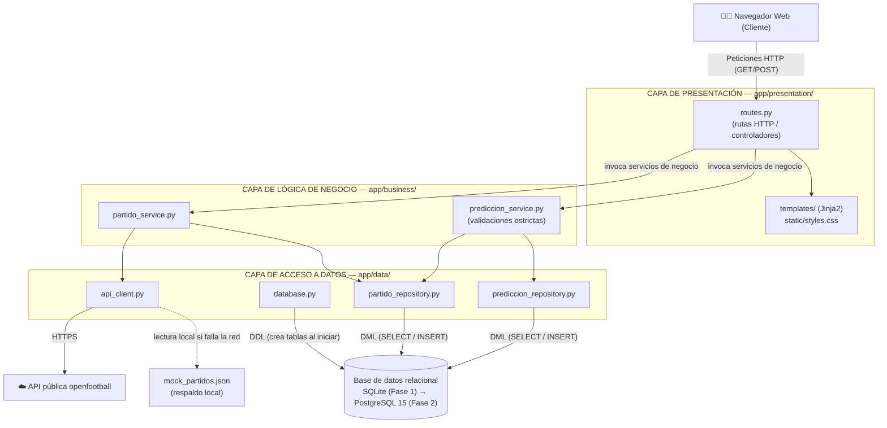
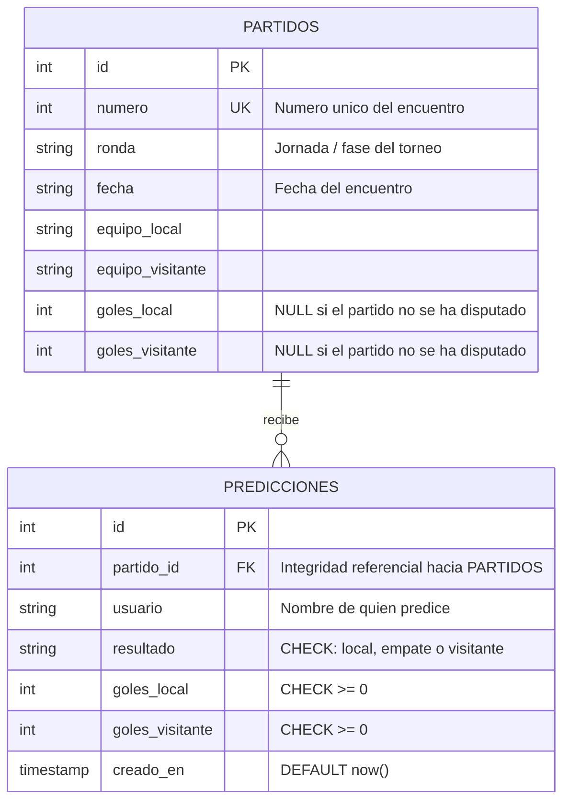
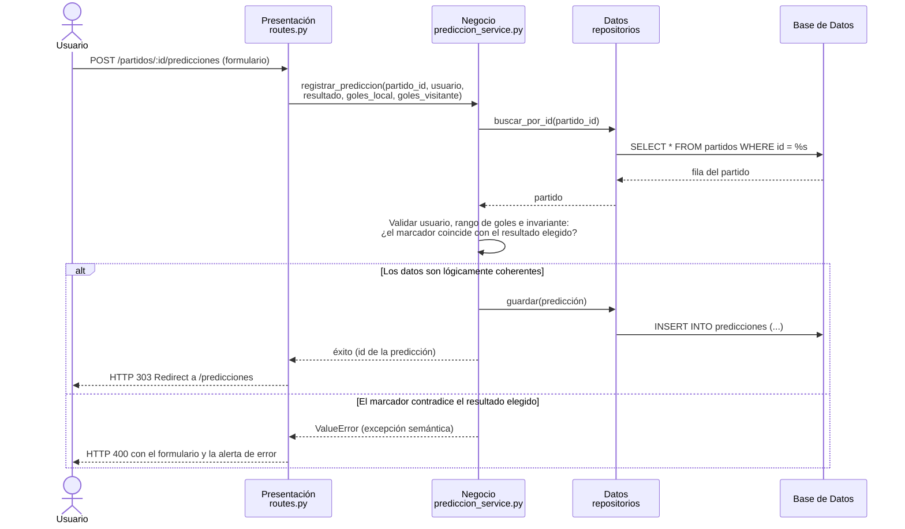

# Informe de Laboratorio 05 — Contenedores y Cloud

**Curso:** Computación Cognitiva / Arquitectura Cloud
**Aplicación:** Sistema de Gestión de Predicciones del Mundial de Fútbol
**Arquitectura:** 3 Capas (Presentación, Negocio, Datos) + Docker + AWS Academy

---

## Pregunta 1: Desarrollo de Aplicación en Capas (12 Puntos)

Se diseñó e implementó una aplicación web completa para la visualización de partidos del Mundial de Fútbol y el registro de predicciones de marcadores por parte de los usuarios. El desarrollo se ejecutó bajo una rigurosa arquitectura de tres capas independientes, asegurando que la capa de presentación no interactúe con el motor relacional y que la capa de acceso a datos desconozca por completo las reglas de negocio de la aplicación.

> **Nota de evolución:** en la Fase 1 (desarrollo local) la base de datos relacional fue **SQLite**; en la Pregunta 2 la capa de acceso a datos se migró a **PostgreSQL 15** sin modificar una sola línea de las capas de negocio ni de presentación, lo que evidencia la correcta separación de responsabilidades.

### 1.1. Arquitectura de Software y Árbol de Directorios

La separación física de responsabilidades quedó estructurada en WSL (Ubuntu) de la siguiente manera:

```text
s12lab/
├── app/
│   ├── main.py                       # Punto de entrada (lifespan, une las 3 capas)
│   ├── presentation/                 # CAPA 1: Presentación
│   │   ├── routes.py                 #   Rutas HTTP / controladores
│   │   ├── banderas.py               #   Filtro Jinja2 (país -> bandera emoji)
│   │   ├── templates/                #   Vistas HTML (base, partidos, predecir, predicciones)
│   │   └── static/styles.css         #   Estilos CSS propios (tema "Noche de Estadio")
│   ├── business/                     # CAPA 2: Lógica de Negocio
│   │   ├── partido_service.py        #   Sincronización idempotente desde la API
│   │   └── prediccion_service.py     #   Validaciones lógicas y semánticas de predicciones
│   └── data/                         # CAPA 3: Acceso a Datos
│       ├── database.py               #   Conexión a la BD, creación de tablas y reintentos de arranque
│       ├── partido_repository.py     #   SQL de partidos
│       ├── prediccion_repository.py  #   SQL de predicciones
│       ├── api_client.py             #   Consumidor HTTP de la API pública externa
│       └── mock_partidos.json        #   Dataset JSON de respaldo ante caídas de red
├── requirements.txt                  # Dependencias de la aplicación
└── INFORME.md
```

### 1.2. Diagrama de Bloques y Dependencias de la Arquitectura

El siguiente diagrama describe el flujo jerárquico unidireccional implementado en el sistema: cada capa solo conoce a la capa inmediatamente inferior.



### 1.3. Diagrama de Entidad-Relación (Base de Datos)

El esquema relacional que soporta la integridad referencial del sistema se detalla a continuación:



### 1.4. Flujo de Datos y Control de Excepciones Semánticas

Cuando un usuario registra una predicción, el sistema no inserta los datos a ciegas; primero recupera el partido correspondiente desde el repositorio y somete el marcador ingresado a una evaluación de coherencia lógica en la Capa de Negocio:



### 1.5. Evidencias de Funcionamiento de la Pregunta 1 (Entorno Local)

#### Evidencia 1.5.1: Panel Principal de Navegación (Home)

Se implementó una interfaz responsiva con Bootstrap 5 bajo el concepto de diseño *"Noche de Estadio"*. Al iniciar, la aplicación consume de manera idempotente la API externa y almacena los **64 partidos** en la base de datos, renderizándolos en tarjetas dinámicas agrupadas por su respectiva jornada de competición, con el marcador real de cada encuentro.


#### Evidencia 1.5.2: Apertura de Ticket de Encuentro para Predicción

Al pulsar el botón "Predecir" de un partido, la aplicación despliega la vista de registro de predicciones con la identidad visual de ambas selecciones (generada por el filtro Jinja2 `banderas.py`; en Windows los emoji de bandera se representan con el código ISO del país). En la captura se completa una predicción coherente: usuaria "Kiara", resultado "Gana Russia" y marcador 2-1.


#### Evidencia 1.5.3: Ingreso de una Predicción Lógicamente Incoherente

La robustez de la Capa de Negocio se demuestra ingresando datos incoherentes: se digitó un marcador de **0 goles para Rusia y 2 para Arabia Saudita** (victoria visitante), pero se mantuvo seleccionada deliberadamente la opción **"Gana Russia"**.


#### Evidencia 1.5.4: Renderizado de Mensajes de Error Semánticos (HTTP 400)

Al procesar el POST incoherente del paso anterior, la capa de presentación captura el `ValueError` devuelto por la Lógica de Negocio y vuelve a renderizar el formulario con una alerta contextual que detalla el fallo: *"El marcador 0-2 implica victoria de Saudi Arabia, pero elegiste victoria de Russia. Corrige la predicción."*


#### Evidencia 1.5.5: Persistencia Relacional y Consulta de Predicciones

Las predicciones que superan los criterios de integridad se insertan asociadas a su partido (clave foránea `partido_id`) y el usuario es redirigido a la vista consolidada. Se observa la predicción registrada en 1.5.2 (Kiara, Russia, 2-1) con su fecha de registro en UTC.


---

## Pregunta 2: Dockerización y Despliegue Cloud (8 Puntos)

Para aislar la aplicación de configuraciones de hardware locales y garantizar su portabilidad en entornos de producción, se encapsuló la solución bajo una arquitectura multi-contenedor.

### 2.1. Arquitectura de Contenedores Local (Dockerfile + `docker-compose.yml`)

Se reemplazó la base de datos SQLite de la fase de desarrollo por un motor **PostgreSQL 15**, y se construyó un **`Dockerfile`** optimizado para la aplicación: imagen base ligera `python:3.12-slim`, instalación de dependencias antes de copiar el código (aprovechando la caché de capas) y ejecución con un usuario sin privilegios de root. El entorno orquestado define dos servicios:

* `web`: backend FastAPI construido desde el `Dockerfile`, exponiendo el puerto interno 8000 hacia el puerto 8000 del host.
* `db`: imagen oficial `postgres:15` con almacenamiento persistente mediante el volumen nombrado de Docker **`datos_postgres`**, lo que impide la pérdida de información ante la destrucción y recreación del contenedor. Incluye un `healthcheck` (`pg_isready`) que obliga al contenedor `web` a esperar (`depends_on: condition: service_healthy`) a que PostgreSQL acepte conexiones.

La configuración sensible viaja por **variables de entorno** definidas en `.env` y `docker-compose.yml`: `POSTGRES_USER`, `POSTGRES_PASSWORD` y `POSTGRES_DB` para el servicio `db`, y `DB_HOST`, `DB_PORT`, `DB_NAME`, `DB_USER`, `DB_PASSWORD` para el servicio `web` (leídas por `database.py`). Como defensa adicional, `database.py` implementa un mecanismo de reintentos (`esperar_base_de_datos()`) por si la aplicación arrancara antes que la base de datos.

#### Evidencia 2.1.1: Estado de Salud de la Infraestructura de Contenedores

Mediante `docker ps` se comprueba el correcto aislamiento de los contenedores locales: `mundial-db` (postgres:15) se reporta en estado saludable (`healthy`) y `mundial-web` publica el puerto 8000, tras haberse inicializado correctamente contra la base de datos.


#### Evidencia 2.1.2: Validación del Funcionamiento Multi-Contenedor

Captura del navegador accediendo a la aplicación dockerizada local en `http://localhost:8000`. Esto comprueba que los repositorios de la capa de datos migraron exitosamente del dialecto SQLite al de PostgreSQL (placeholders `%s`, `ON CONFLICT ... DO NOTHING`, `RETURNING id`), manteniendo el frontend totalmente transparente para el cliente.


---

### 2.2. Publicación de la Solución en Docker Hub

Para que cualquier proveedor de computación en la nube pueda descargar el artefacto de software de forma inmutable, la imagen local se etiquetó y publicó en el registro público de Docker Hub bajo el repositorio `kiarosaurus/mundial-web:latest`:

```bash
docker tag s12lab-web:latest kiarosaurus/mundial-web:latest
docker push kiarosaurus/mundial-web:latest
```

#### Evidencia 2.2.1: Repositorio en Docker Hub (Vista de Perfil)

Se visualiza la cuenta `kiarosaurus` en Docker Hub confirmando la creación del repositorio `kiarosaurus/mundial-web` dedicado a la imagen del laboratorio.


#### Evidencia 2.2.2: Tag y Digest de la Imagen Publicada

Vista detallada del repositorio público donde se certifica la publicación con la etiqueta `latest`, digest `sha256:1e4cf037a...` y un tamaño comprimido de 58.1 MB (gracias a la imagen base slim), lista para su distribución global vía `docker pull`.


---

### 2.3. Despliegue e Infraestructura Automatizada en AWS Cloud

Tomando en cuenta las restricciones administrativas del entorno educativo **AWS Academy** (no se permite crear roles IAM personalizados, políticas ni VPCs nuevas), el aprovisionamiento se automatizó al 100% mediante scripts que consumen la **AWS CLI**, apoyándose exclusivamente en la infraestructura por defecto de la cuenta:

1. `deploy_aws.sh`: descubre automáticamente la **VPC por defecto** y una de sus subredes públicas; crea el **Security Group** `mundial-sg` con reglas de firewall para tráfico TCP entrante en los puertos `80` (HTTP), `8000` (app) y `22` (SSH); resuelve la última AMI oficial estable de **Ubuntu 24.04** consultando el parámetro público de Canonical en SSM; y lanza una instancia **EC2 `t3.micro`** en esa subred con IP pública, el key pair `vockey` del laboratorio, la etiqueta `Name=mundial-web` y el `user_data.sh` inyectado. Finalmente espera a que la instancia esté `running` y reporta su IP pública.
2. `user_data.sh`: script ejecutado en el primer arranque de la EC2 (cloud-init) que automatiza el aprovisionamiento interno: instala de forma desatendida Docker y el plugin de Compose, escribe un `docker-compose.yml` **de producción** —que en lugar de hacer build descarga la imagen `kiarosaurus/mundial-web:latest` desde Docker Hub y levanta también `postgres:15` con su volumen persistente— y ejecuta `docker compose up -d`, publicando la aplicación en los puertos 80 y 8000.

#### Evidencia 2.3.1: Instancia Aprovisionada en la Consola AWS

Captura del panel de AWS EC2 que muestra la instancia `mundial-web` (`i-0a173ac8227f37622`) creada automáticamente por el script, junto con su resumen de detalles (IP pública e IP privada asignadas dentro de la VPC por defecto).


#### Evidencia 2.3.2: Instancia EC2 Activa en Producción

Confirmación desde la consola: la instancia se encuentra en estado **Running**, asociada al security group `mundial-sg` y al key pair `vockey`, exponiendo la dirección IP pública productiva **`107.20.57.56`**.


---

### 2.4. Pruebas End-to-End (E2E) y Validaciones en la Nube

Una vez aprovisionado el entorno en AWS, se testeó la aplicación real expuesta en internet a través de la IP pública `107.20.57.56`. Las validaciones operan en **defensa en profundidad**: el formulario HTML limita los valores en el navegador (`min=0`, `max=20`), la Capa de Negocio re-valida el rango 0–20 y la coherencia semántica en el servidor, y la base de datos impone sus propios `CHECK`.

#### Evidencia 2.4.1: Registro de una Predicción Válida en Producción

Acceso al formulario productivo servido desde AWS. La interfaz se renderiza de forma fluida y se completa una predicción coherente del usuario "DemoCloud": victoria de Rusia 3-0.


#### Evidencia 2.4.2: Validación de Límite Superior de Goles

Se intentó ingresar un marcador absurdo de **50 goles**. La primera línea de defensa (atributo `max="20"` del formulario) bloquea el envío en el propio navegador con el mensaje *"El valor debe ser inferior o igual a 20"*; la misma regla existe en la Capa de Negocio (rango máximo de 20 goles), que la haría cumplir ante cualquier petición construida fuera del formulario.


#### Evidencia 2.4.3: Validación de Límite Inferior (Valores Negativos)

Análogamente, al intentar registrar **-1 goles** el formulario lo rechaza con *"El valor debe ser superior o igual a 0"*. Esta regla también está replicada en la Capa de Negocio y como restricción `CHECK (goles >= 0)` en las columnas de PostgreSQL, garantizando la consistencia matemática de las tablas incluso ante clientes manipulados.


#### Evidencia 2.4.4: Control de Incoherencia Lógica en Producción

Prueba de la validación semántica del servidor en la nube: se envió un marcador de **2-1** (victoria local) seleccionando la opción **"Empate"**.


El backend en AWS rechaza la transacción con HTTP 400 y devuelve el formulario con el detalle exacto de la contradicción: *"El marcador 2-1 implica victoria de Russia, pero elegiste un empate. Corrige la predicción."* El dato corrupto nunca llega a la base de datos.


#### Evidencia 2.4.5: Persistencia y Escritura Exitosa en PostgreSQL Cloud

Las predicciones válidas del usuario "DemoCloud" (3-0 y 2-1, ambas victoria de Rusia) superaron todos los filtros y quedaron almacenadas en el volumen persistente del contenedor PostgreSQL en AWS, listadas con su marca de tiempo UTC. Esto demuestra el funcionamiento integral de la arquitectura de software y de su despliegue automatizado en la nube.

